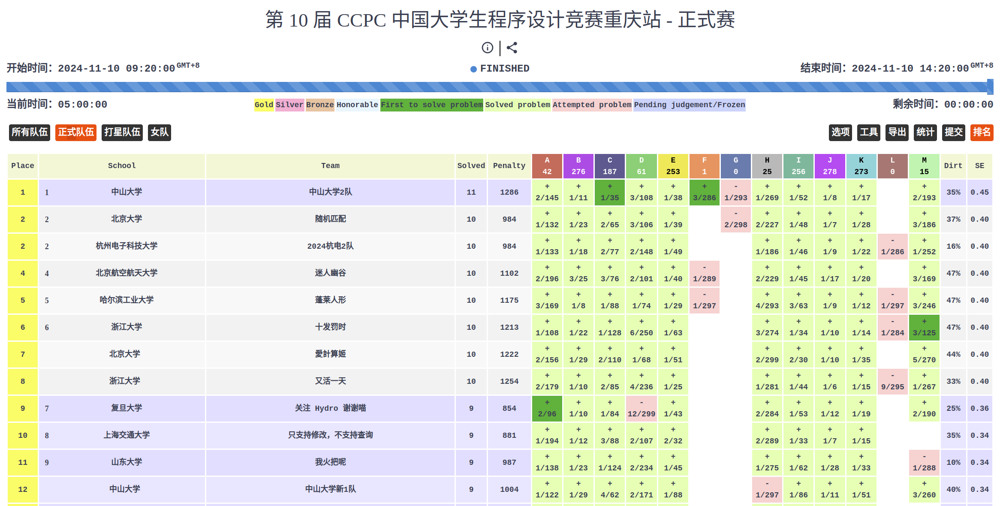

# Part 1: ACM
## 比赛
[去各地比赛的地图，试试拖动标签找到我的所有奖项](/htmls/map.html)

网页里写的很全了，我文字也写一下吧，中间有很多坎坷，也有很多心路历程，但已经在别处记录过了，就不再赘述

4月，团体程序设计天梯赛二等奖

4月，浙江省大学生程序设计竞赛季军

5.12，河南省大学生程序设计竞赛第六名

5.19，北京市大学生程序设计竞赛银奖

5.27，山东省大学生程序设计竞赛季军

10.20，全国大学生程序设计竞赛哈尔滨站银奖

11.3，国际大学生程序设计竞赛南京站金奖

11.10，全国大学生程序设计竞赛重庆站季军（与PKU随机匹配在榜单上并列第二哦）

11.17，国际大学生程序设计竞赛上海站银奖

12.30

## 出题&验题
今年在内蒙省赛、杭电多校、校新生赛上各出了一道题，帮雄哥小验了一下广西省赛（就验了一道，但也算验题人是吧，简历里都是可以写的）。

内蒙省赛用的是我初一出的一道题，完全没改动，没想到全省只有两个队过。插一句题外话，我不打acm的室友都做出来了，只不过用的矩阵快速幂，还有一些繁琐的步骤。std直接一个式子结束。

我着重讲一下杭电多校出的那道题吧，出完这道题的时候我整个人都惊了，这种难度的题我自己都很少很少能做出来，结果竟然被我出出来了。并且幸亏一队在验题的时候验出我题目的错误，不然就是丢大人了，而不是光辉事迹。

给大家看一下战绩：
全国打杭电多校的大学生队伍就四个队做出来，三支是PKU，高中生的话多俩杭二和南外的队伍。我何德何能啊。

题目：$x_1^{t_1}x_2^{t_2}...x_k^{t_k}\leq n$ 且 $gcd(x_1,x_2,...,x_k)=1$ ，求有序数对 $(x_1,x_2,...,x_k)$ 数量，答案对$1e9+7$取模

[题解](https://xmy1107.github.io/post/min25)就不放在这了，放了跑题了……

# Part 2: 数模
美赛的名额是靠acm金软磨硬泡出来的，训了两次就正式比赛了，拿了M奖非常的意料之外，因为之前只在新生赛做过一次数模，就一个成功参赛奖。跟她俩确实也学到很多数模的经验。但打完以后，我可以说就出师了，要学的东西很少，或者说都是可以现学的。

有了美赛的经历，加上周慧的鼓动，还有我需要保研的特推名额等种种因素，让我决定打国赛。软膜硬泡*2，训练三次即可打国赛。王景煜是个特别强的队友，文本、建模、代码都很顶级，只可惜周慧这货纯傻逼，之前打美赛根本没看清这个人，这直接导致最后只拿到了国二。

通过聊天记录说明一下国二的原因吧
  

控诉一下周慧的n宗罪：完全听不懂我们的建模瞎出主意、二维的题目直接拿GPT生成三维的模型用、比赛期间游戏打到凌晨五点早上不来做题、问题复述都写不端正、没事干就在旁边打游戏干扰我们、抄个数据抄错了还是王景煜找出来的错误……但凡她有点正贡献，给我省下三四个小时的时间，我所有代码的变步长搜索的手动调参都可以改成自动调参，这也是我本来就要改的东西。她这些行为直接导致所有文本建模都是王景煜一人完成的，代码和结果都是我完成的，而且独立运作，到提交我都没有细看过一遍论文！

 

国赛成绩在[中国大学生助手](https://dxs.moe.gov.cn/zx/awards/index.shtml)中查询

# Part 3: 一些不算项目的项目或未完成的项目
## 华为嵌入式软件大赛
初赛交了个输出0的代码，结果直接进复赛了。但我真没想好好打复赛，练习赛就草草写了个还跑不出的代码就去杭研所了，没想到最后跑出来了，还跑了22w分，第六名。一共开放了三个月的时间大概，我就做了一个下午+一晚上+比赛的五个小时就第六了，真是意外。

## 三维重建
题目就是给定rgb图、深度图和相机内参，重建模型和渲染。
主要靠的龙哥和慧源。但我该做的也都做了，nerf跟着跑了，sam分割图像部分我做了，还做了个手动标点的小工具。但最后就19名，也没成果产出，用的都是开源的东西，似乎也不好放进简历，算是个小锻炼吧。

## 微表面建模
[still working](https://xmy1107.github.io/post/%E5%BE%AE%E8%A1%A8%E9%9D%A2%E9%87%8D%E5%BB%BA)

# Part 4: 一些零零散散的小收获
## 健身
3月开始划水到现在，小有成效。体重从120增到了140，能稍微看出点肌肉了（但还对于健身人来讲就是，排骨精=>毫无健身痕迹。慢慢练吧，右手有缺陷，强度大会痛）。体测的时候引体硬拉15个，立定跳远两米八（其实我觉得是2.85），卧推可以40kg做十几个，差不多就行，嘻嘻。

## 唱歌
基本功一直不大扎实，且不大学的会（真的已经努力了，还花了小两千买线上课自己学，真学不会），所以干脆退了合唱队的训练群，自己瞎练。还真给我练出点东西来了。

[High D, 不是假音哦](https://www.bilibili.com/video/BV1zTWSeREo4/?spm_id_from=333.1387.homepage.video_card.click)

然后3.24看了张杰演唱会上海站，5月123场外看了两场演唱会。张杰的唱过的歌我现在至少会唱一百首！

邓紫棋演唱会todo

## 理论计算机（TCS）
今年四月份转的专业方向，在这之前还是一直有在读论文和寻找tcs的idea的，是占用我时间的最大头。虽然有人“挖苦”我，在这上面白花这么多时间，但我其实并不后悔，tcs给我最大的收获是让我知道，这个世界就是存在很多无法用简洁语言描述的东西。即便是正态分布、傅里叶变换的公式我也会觉得很简洁很优美，但tcs真给我当头一棒，全都是那种恶心到爆，还无法简化的证明。正是在书桌前一整天一整天的绞尽脑汁，才让我真的认命。而学会接受世界的复杂反而让我渐渐看懂这个世界了，很多事情全都得以解释。

## 思想
感觉这一年进步最大的其实是我的思想，它比较抽象所以我也没放上面说。我遇到了许许多多的人、碰到了许许多多的困难，也有许许多多开心的事情让我回味。和人打交道让我越来越像个人了，能渐渐把“抽象”变成“幽默”（以前真不是人吧，用lsh的话讲就是“是不是刚来地球”），解决一个又一个我以为我解决不了的困难也我有了面对一切困难的勇气。总的来说，一切都在越来越好，这一年我捋清楚了我是怎样一个人，我要干什么，我的未来在哪里，成功回答了去年留给自己的那些疑问。希望新的一年，一切都能变得更好！！！

## Entertainment
用英语显得正经一点，符合文章的基调。

今年打了老多游戏。特别是装了双系统之后，4070s+1TB的游戏+潘泽宇300多个游戏的账号，真的如虎添翼如鱼得水。黑猴、传送门、Dying Light、地平线……但玩了一圈发现还是原神、箭箭剑这种好玩儿。以后可以考虑玩奇迹暖暖[doge]

游戏玩厌了，感觉追剧贼有意思。永夜星河和其团综刚看完，月光变奏曲、九重紫啥的都是接下来想看的。感觉玩游戏可累了，追剧一点都不累，还养眼。

## 一些更琐碎、难分类的东西
比如上面用高德api做的地图、比如搭了博客、比如花了三天时间自己装的电脑

还有双放手很熟练喽，都可以转弯了，录的视频不多，只能放一下这个有点丢人的了
[双放手录视频+唱歌，九十度弯摔了](/htmls/双放手.html)

当了班助，加了朗诵社，认识了很多新的朋友，新生们也都很有意思。可惜班里人数太多，新生谈话没法谈得很久，本来还挺享受这种和两年前的我交流的感觉的，我也很喜欢代入一个个同学的角度进行分析。本以为这学期会比较闲，朗诵社可以全勤了，没想到请了一半的假……真是有点……

8.1组织了同学聚会，不得不说，召集和组织八年未见的老同学们还是颇有难度的。从开始的建群拉人到中间定时间定酒店，每个步骤都能碰到问题。核心的难点线上通知下达落实的太慢，以及无法兼顾每个人的情绪。当时也挺害怕自己搞砸的。不过一切都顺利完成，并且和好多小学的同学都恢复了联系！

化妆会了一捏捏，但从来不用，或者说只有不见人的时候才会自己玩玩。双眼皮贴会贴了，直板夹能稍微夹出点纹理，素颜霜会涂，知道化妆的流程，所以也没很卡粉，还能消黑眼圈和遮痘印。

进行了国奖答辩、科创先锋、笃学模范、青年领英的答辩，颇有收获，知道了汇报的重心、评奖的机制和其核心要领等等（不细讲了，这部分就写给自己看一下），希望明年能汲取今年积累的经验，百战百胜

# 对2025的展望
总是说着要摆烂要摆烂，结果不知不觉还是干了一件又一件事，甚至下学期很多事也找了上门，我会想办法推掉一点。

工作的机会、保研的机会、挣钱的机会……我总是想不错过任何一个机会，但若是一直这样，我对学习外事物的热情会一点点被消磨殆尽。列了几十件想干的事了，虽然有的太天马星空难以实现，但怎么说也去做一点吧，不然这一辈子也太无趣了。我总是想着现在努力了，以后就可以少努力一点，可我现在觉得，**越努力，之后越是有的努力**，越吃苦，越是要吃一辈子的苦，~~所以别把时间荒废在学习上了~~。

新的一年，我要做到以下三点：活得轻松一点，想法简单一点，性格阳光一点。