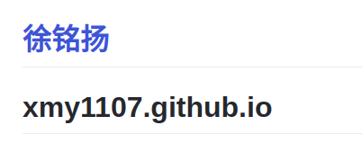
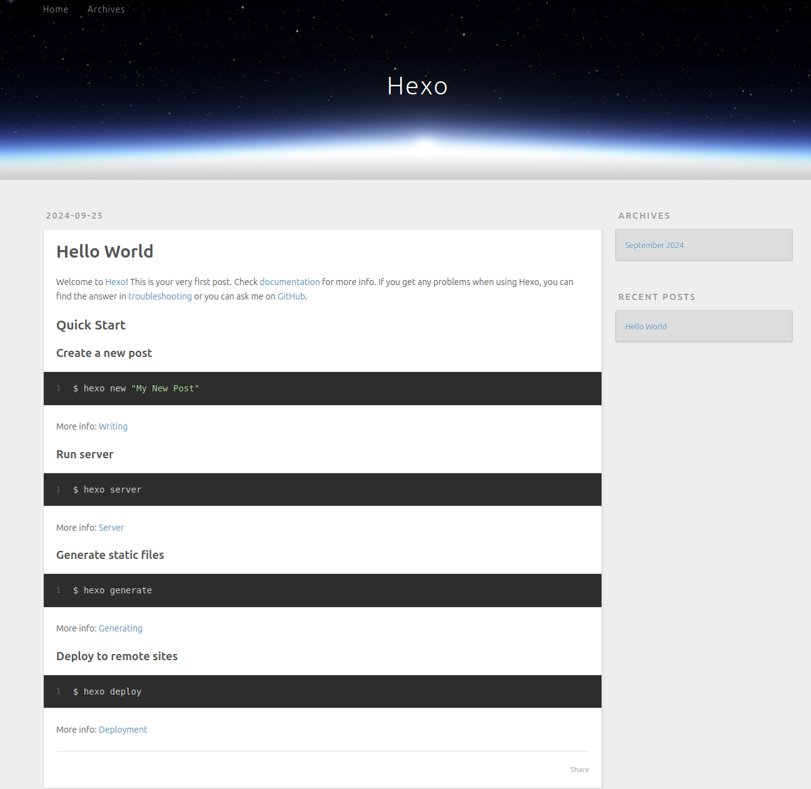
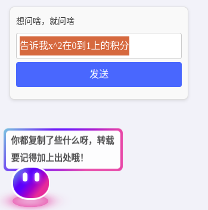
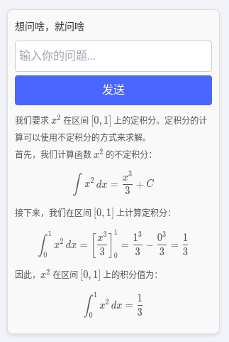
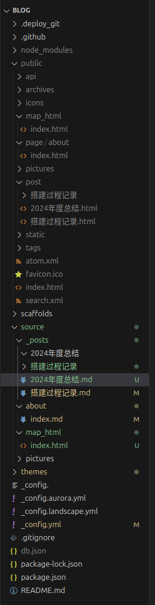
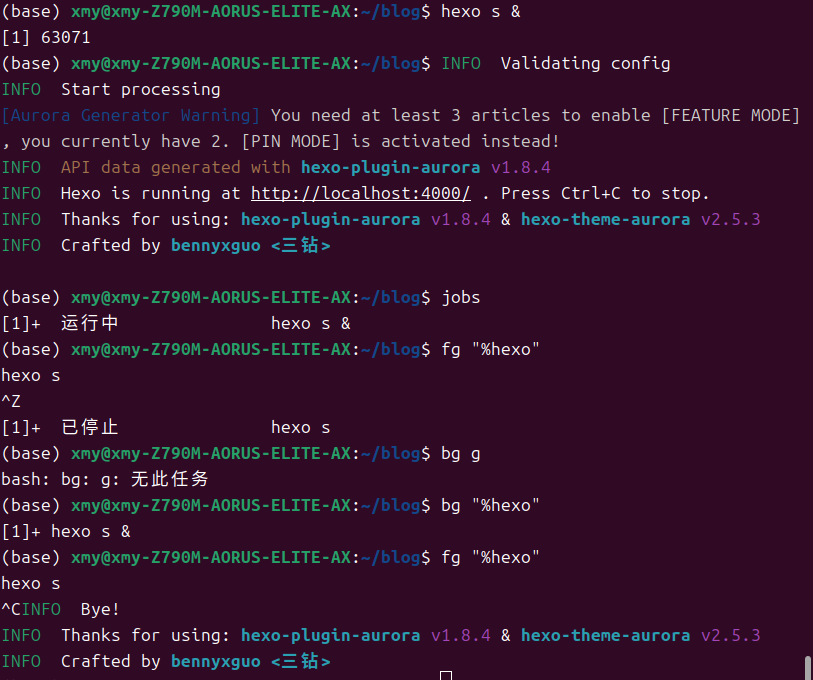

[hexo官方文档](https://hexo.io/zh-cn/docs/)

以下是自己的搭建过程（包括怎么git）：

# 1. 建立名为 **username.github.io**的储存库

# 2. first commit

```bash
(base) xmy@xmy-Z790M-AORUS-ELITE-AX:~$ mkdir blog
(base) xmy@xmy-Z790M-AORUS-ELITE-AX:~$ cd blog
(base) xmy@xmy-Z790M-AORUS-ELITE-AX:~/blog$ hexo init
INFO  Cloning hexo-starter https://github.com/hexojs/hexo-starter.git
INFO  Install dependencies
INFO  Start blogging with Hexo!
(base) xmy@xmy-Z790M-AORUS-ELITE-AX:~/blog$  git push -u origin main
fatal: 不是 git 仓库（或者直至挂载点 / 的任何父目录）
停止在文件系统边界（未设置 GIT_DISCOVERY_ACROSS_FILESYSTEM）。
```

完全按hexo步骤来会在这步卡住，因为git仓库都没有初始化

```bash
(base) xmy@xmy-Z790M-AORUS-ELITE-AX:~/blog$ echo "# xmy1107.github.io" >> README.md
（这里漏了git init，这个记得输入）
(base) xmy@xmy-Z790M-AORUS-ELITE-AX:~/blog$ git add README.md
(base) xmy@xmy-Z790M-AORUS-ELITE-AX:~/blog$ git commit -m "first commit"
[main （根提交） 8956e78] first commit
 1 file changed, 1 insertion(+)
 create mode 100644 README.md
(base) xmy@xmy-Z790M-AORUS-ELITE-AX:~/blog$ git remote add origin https://github.com/xmy1107/xmy1107.github.io.git
(base) xmy@xmy-Z790M-AORUS-ELITE-AX:~/blog$ git push -u origin main
Username for 'https://github.com': xmy1107
Password for 'https://xmy1107@github.com': 
```

这里初始化并进行第一次提交以后就建站成功了。注意password不是你用户的密码，而是personal access token。如果是ssh连接就是这样（我用PAT能登进去，但每次都要重新输入，但用ssh在把公钥放进去以后不用这样，就用ssh了）：

```bash
(base) xmy@xmy-Z790M-AORUS-ELITE-AX:~/blog$ git remote get-url origin
https://github.com/xmy1107/xmy1107.github.io.git
(base) xmy@xmy-Z790M-AORUS-ELITE-AX:~/blog$ git remote set-url origin git@github.com:xmy1107/xmy1107.github.io.git
(base) xmy@xmy-Z790M-AORUS-ELITE-AX:~/blog$ git remote get-url origin
git@github.com:xmy1107/xmy1107.github.io.git
(base) xmy@xmy-Z790M-AORUS-ELITE-AX:~/blog$ git push -u origin main
枚举对象中: 3, 完成.
对象计数中: 100% (3/3), 完成.
写入对象中: 100% (3/3), 227 字节 | 227.00 KiB/s, 完成.
总共 3（差异 0），复用 0（差异 0），包复用 0
To github.com:xmy1107/xmy1107.github.io.git
 * [new branch]      main -> main
分支 'main' 设置为跟踪 'origin/main'。
```

然后在 **https://xmy1107.github.io/** 下就有一个空的网页：



ps：PAT想要不每次输密码可以尝试

`vim ~/.gitconfig`后输入以下内容（虽然我没成功）

```
[init]
        defaultBranch = main
[user]
        name = 
        email = 
[github]
        token = 
```

# 3. 网站正式建立

上面是因为只push了一个README，下面对github工作流配置后再次push可以得到”正常“的一个网页

1. 使用 `node --version` 指令检查你电脑上的 Node.js 版本。 记下主要版本（我是`v20.17.0`）

2. 在储存库中前往 **Settings** > **Pages** > **Source** 。 将 source 更改为 **GitHub Actions**，然后保存。

3. 在储存库中建立 `.github/workflows/pages.yml`，并填入以下内容 (将 `20` 替换为上个步骤中记下的版本)：

```yaml
.github/workflows/pages.ymlname: Pages

on:
  push:
    branches:
      - main # default branch

jobs:
  build:
    runs-on: ubuntu-latest
    steps:
      - uses: actions/checkout@v4
        with:
          token: ${{ secrets.GITHUB_TOKEN }}
          # If your repository depends on submodule, please see: https://github.com/actions/checkout
          submodules: recursive
      - name: Use Node.js 20
        uses: actions/setup-node@v4
        with:
          # Examples: 20, 18.19, >=16.20.2, lts/Iron, lts/Hydrogen, *, latest, current, node
          # Ref: https://github.com/actions/setup-node#supported-version-syntax
          node-version: "20"
      - name: Cache NPM dependencies
        uses: actions/cache@v4
        with:
          path: node_modules
          key: ${{ runner.OS }}-npm-cache
          restore-keys: |
            ${{ runner.OS }}-npm-cache
      - name: Install Dependencies
        run: npm install
      - name: Build
        run: npm run build
      - name: Upload Pages artifact
        uses: actions/upload-pages-artifact@v3
        with:
          path: ./public
  deploy:
    needs: build
    permissions:
      pages: write
      id-token: write
    environment:
      name: github-pages
      url: ${{ steps.deployment.outputs.page_url }}
    runs-on: ubuntu-latest
    steps:
      - name: Deploy to GitHub Pages
        id: deployment
        uses: actions/deploy-pages@v4
```

这个过程相当于`hexo generate`和`hexo deploy`，区别是在`git push`时才执行，然后用github工作流完成渲染和部署。

这一步结束后重新打开博客便是如下页面：




4. 部署完成后，前往 *username*.github.io/*repository* 查看网页。

# 4.一键部署

1. 安装 [hexo-deployer-git](https://github.com/hexojs/hexo-deployer-git)，即输入`npm install hexo-deployer-git --save`
2. 在 `_config.yml` 中添加以下配置（如果配置已经存在，请将其替换为如下）:

```yml
deploy:
  type: git
  repo: https://github.com/<username>/<project>
  # example, https://github.com/hexojs/hexojs.github.io
  # 我这里是git@github.com:xmy1107/xmy1107.github.io.git，因为我是ssh连接的
  # git@github.com:xmy1107/blog.git是项目页面
  branch: main # hexo给的是gh-pages，无所谓
```

3. 这里要把网站建立中**GitHub Actions**改回**Deploy from a branch**，因为使用 `hexo d` 时，它会跳过 GitHub Actions，直接将 `public` 文件夹中的静态文件推送到 `gh-pages` 分支。 GitHub Actions对应的操作是`git push`
4. 执行 `hexo clean && hexo deploy` 。
5. 浏览 *username*.github.io，检查你的网站能否运作。

# 5.后续配置

主题选用[Academia](https://github.com/PhosphorW/hexo-theme-academia)

改用[aurora](https://github.com/auroral-ui/hexo-theme-aurora)

# 6.Aurora
见[doc](https://aurora.tridiamond.tech/cn/guide/getting-started.html)

## Gitalk
创建一个 comments 仓库，配置一下 OAuth App 即可
```yml
gitalk:
  enable: true
  autoExpand: true
  clientID: ''
  clientSecret: ''
  repo: 'blog-comments' ## dev-blo-comments
  owner: 'xmy1107' ## owner name
  admin: ['xmy1107'] ## ['admin_name']
  id: location.pathname
  language: en
  distractionFreeMode: true
  recentComment: true
  proxy: ''
```
开始一直无法启用是因为一直在本地测试，而 GitHub OAuth 不允许本地地址作为 Authorization callback URL，redirect_uri 一直与其冲突。部署上去就大功告成了！

## 对话功能
一个简单的示例：

 

在`/home/xmy/blog/node_modules/hexo-theme-aurora/layout`下修改index.ejs中代码为：
```html
<!DOCTYPE html>
<html lang="en">

<head>
    <meta charset="UTF-8">
    <meta http-equiv="X-UA-Compatible" content="IE=edge">
    <meta name="viewport" content="width=device-width,initial-scale=1">
    <link rel="icon" href="/favicon.ico">
    <script type="module" crossorigin src="/static/js/120aa8f8.js"></script>
    <link rel="stylesheet" href="/static/css/a14e1a22.css">
    <!-- 引入 KaTeX -->
    <link rel="stylesheet" href="https://cdn.jsdelivr.net/npm/katex@0.16.4/dist/katex.min.css">
    <script src="https://cdn.jsdelivr.net/npm/katex@0.16.4/dist/katex.min.js"></script>
    <script src="https://cdn.jsdelivr.net/npm/katex@0.16.4/dist/contrib/auto-render.min.js"></script>
    <!-- 引入 marked.js 和 DOMPurify 库 -->
    <script src="https://cdn.jsdelivr.net/npm/marked/marked.min.js"></script>
    <script src="https://cdn.jsdelivr.net/npm/dompurify@2.4.0/dist/purify.min.js"></script>
    <style>
        #aurora-chatbox {
            transition: opacity 0.3s ease-in-out, transform 0.3s ease-in-out;
            opacity: 0;
            transform: translateY(10px);
        }

        #aurora-chatbox.active {
            opacity: 1;
            transform: translateY(0);
        }
    </style>
</head>

<body id="body-container">
    <noscript>
        <strong>We're sorry but this app doesn't work properly without JavaScript enabled.
            Please enable it to continue.</strong>
    </noscript>
    <div id="app"></div>
    <button id="showChatbox" style="
    position: fixed;
    bottom: 20px;
    left: 20px;
    width: 80px;
    height: 80px;
    padding: 0;
    background-color: #007bff;
    color: white;
    border: none;
    border-radius: 50%;
    font-size: 16px;
    cursor: pointer;
    z-index: 10000;
    box-shadow: 0px 4px 10px rgba(0, 0, 0, 0.2);
    opacity:0;">
    聊天
    </button>


    <!-- Aurora 机器人聊天框，固定在页面左下角 -->
    <div id="aurora-chatbox" style="
    position: fixed;
    bottom: 200px;
    left: 20px;
    width: 350px;
    background: linear-gradient(to bottom right, #ffffff, #f1f7ff);
    border: none;
    border-radius: 12px;
    box-shadow: 0px 4px 20px rgba(0, 0, 0, 0.1);
    z-index: 9999;
    font-family: Arial, sans-serif;
    overflow: hidden;
    ">
    <!-- 标题栏 -->
    <!-- <div style="
        background-color: #007bff;
        color: #ffffff;
        padding: 10px 15px;
        font-size: 16px;
        font-weight: bold;
        border-top-left-radius: 12px;
        border-top-right-radius: 12px;
        text-align: center;">
        Aurora 聊天机器人
    </div> -->
    <!-- 聊天框主体 -->
    <div style="
        padding: 15px;
        display: flex;
        flex-direction: column;">
        <p style="margin: 0; font-size: 14px; color: #333; margin-bottom: 8px;">
            和我聊天吧🤖
        </p>
        <input type="text" id="userInput" placeholder="输入你的问题..."
            style="
                width: calc(100% - 10px);
                padding: 8px;
                margin: 0 auto;
                border-radius: 8px;
                border: 1px solid #ddd;
                box-shadow: inset 0 1px 3px rgba(0,0,0,0.1);
                transition: all 0.3s ease;" />
        <button id="sendMessage" style="
                margin-top: 10px;
                padding: 10px 15px;
                background-color: #007bff;
                color: white;
                border: none;
                border-radius: 8px;
                font-size: 14px;
                cursor: pointer;
                box-shadow: 0 2px 5px rgba(0, 0, 0, 0.2);
                transition: background-color 0.3s ease;">
            发送
        </button>
        <div id="responseBox" style="
                margin-top: 15px;
                min-height: 50px;
                font-size: 12px;
                color: #555;
                background: #f9f9f9;
                border-radius: 8px;
                padding: 8px;
                box-shadow: inset 0px 1px 3px rgba(0,0,0,0.05);
                overflow-y: auto;">
            <!-- 机器人响应展示 -->
        </div>
    </div>
    </div>


    <!-- JavaScript 逻辑 -->
    <script>
        // document.getElementById("showChatbox").addEventListener("click", function () {
        //     const chatbox = document.getElementById("aurora-chatbox");
        //     if (chatbox.style.display === "none" || chatbox.style.display === "") {
        //         chatbox.style.display = "block"; // 显示聊天框
        //     } else {
        //         chatbox.style.display = "none"; // 隐藏聊天框
        //     }
        // });
        document.getElementById("showChatbox").addEventListener("click", function () {
            const chatbox = document.getElementById("aurora-chatbox");
            if (!chatbox.classList.contains("active")) {
                chatbox.classList.add("active"); // 显示聊天框
            } else {
                chatbox.classList.remove("active"); // 隐藏聊天框
            }
        });

        //开发者平台：https://platform.moonshot.cn/console/api-keys
        const API_URL = "https://api.moonshot.cn/v1/chat/completions"; // Kimi AI的API地址
        const API_KEY = "sk-7ZY0XOT24cIgQzar6Sos70L23dCoYkT6SFHAuiCnwVAKkaIK"; // 替换为您的Kimi API密钥
    
        async function sendMessage() {
            const userInput = document.getElementById("userInput").value.trim();
            const responseBox = document.getElementById("responseBox");
    
            if (!userInput) {
                responseBox.innerText = "请输入你的问题！";
                return;
            }
    
            responseBox.innerText = "思考中，请耐心等候（需要10秒左右）...";
    
            try {
                // 发起 Kimi AI API 请求
                const response = await fetch(API_URL, {
                    method: "POST",
                    headers: {
                        "Content-Type": "application/json",
                        "Authorization": `Bearer ${API_KEY}`
                    },
                    body: JSON.stringify({
                        model: "moonshot-v1-8k", // Kimi 模型名称
                        messages: [
                            { role: "system", content: "你是一个网站的助手，下面我会给你一些这个网站的相关信息。\
                            \n网站的主人叫虚名羊，网站是用hexo搭建的，网站链接是https://xmy1107.github.io/，\
                            内容以技术和生活为主。" },
                            { role: "user", content: userInput }
                        ]
                    })
                });
    
                if (!response.ok) {
                    throw new Error("API 请求失败，请检查网络或密钥。");
                }
    
                const data = await response.json();
                const kimiResponse = data.choices[0]?.message?.content || "未获取到有效响应内容。";
                console.log("Kimi Response:", kimiResponse);
    
                // 渲染处理与数学公式展示
                const placeholder = '%%MATH_FORMULA%%';
                let mathBlocks = [];
    
                // 预处理数学公式
                const preprocessedResponse = kimiResponse.replace(/\\\[.*?\\\]|\\\(.*?\\\)/gs, (match) => {
                    mathBlocks.push(match);
                    return placeholder;
                });
    
                // 使用 marked 渲染 Markdown
                const renderedHTML = marked.parse(preprocessedResponse);
    
                // 替换占位符回原始数学公式
                let finalHTML = renderedHTML;
                mathBlocks.forEach((math, i) => {
                    finalHTML = finalHTML.replace(placeholder, math);
                });
    
                // 安全插入 HTML 并渲染数学公式
                responseBox.innerHTML = DOMPurify.sanitize(finalHTML);
                renderMathInElement(responseBox, {
                    delimiters: [
                        { left: "\\(", right: "\\)", display: false }, // 行内公式
                        { left: "\\[", right: "\\]", display: true }  // 块级公式
                    ],
                    throwOnError: false
                });
            } catch (error) {
                responseBox.innerText = "抱歉，出错了：" + error.message;
            }
    
            // 清空输入框
            document.getElementById("userInput").value = "";
        }
    
        // 事件监听：发送按钮和回车键
        document.getElementById("sendMessage").addEventListener("click", sendMessage);
        document.getElementById("userInput").addEventListener("keydown", function (event) {
            if (event.key === "Enter") {
                event.preventDefault();
                sendMessage();
            }
        });
    </script>
    
</body>

</html>
```
令我最头疼的点：正则表达式识别
小小记录下：

`.*?：非贪婪匹配，匹配中间的任意字符，直到遇到下一个 \] 为止。`

`s 标志：启用 dotall 模式，使 . 匹配换行符。`

`g 标志：全局匹配。`

upd：改kimi ai了，gpt有的人可能用不了。

# 一些自己写博客的注意点

## 关于贴html

贴html用相对路径：`[去各地比赛的地图，标签可拖动](/map_html/index.html)`

贴图片用绝对路径：``，便于显示

html文件要禁止渲染，默认会渲染并且放进page目录中。需要在config中加入以下配置：
```
skip_render:
  htmls/**/*.html
```

要放进地址栏的部分得用英文字符，但只是文件链接就不用

`[双放手录视频+唱歌，九十度弯摔了](/htmls/双放手.html)`

html文件中是

```html
<video controls width="500">
    <source src="/videos/shuangfangshou.mp4" type="video/mp4">
    您的浏览器不支持视频标签。
</video>
```

## 本地的目录，供以后参考



## hexo s后台运行



## 数学公式
[hexo-filter-mathjax](https://github.com/next-theme/hexo-filter-mathjax)

记得`front-matter`里加上`mathjax: true`

公式换行需要`\\\\`

需要_config.yml把highlight enable一下，不然只有部分公式可以显示，不知道原理

# TODO LIST
小机器人可以想办法搞得更生动一点
用nodejs啥的把api封装到后端（目前感觉没啥关系，小白不在乎安全性）
代码高亮真的搞不好，主题必须要shiki高亮引擎，而shiki是一个ES Module，与hexo环境不兼容。

# 没搞清楚的部分
## 项目页面（这部分没完全搞清楚）

1. 导航到 GitHub 上的存储库。 转到 **Settings** 选项卡。 建立名为 `<repository 的名字>` 的储存库，这样你的博客网址为 `<你的 GitHub 用户名>.github.io/<repository 的名字>`，repository 的名字可以任意，例如 blog 或 hexo。
2. 编辑你的 `_config.yml`，将 `url:` 更改为 `<你的 GitHub 用户名>.github.io/<repository 的名字>`。
3. 在 GitHub 仓库的设置中，导航至 **Settings** > **Pages** > **Source** 。 将 source 更改为 **GitHub Actions**，然后保存。
4. Commit 并 push 到默认分支上。

注意这里要修改远程的仓库，需要push到新建的那个仓库中

```bash
(base) xmy@xmy-Z790M-AORUS-ELITE-AX:~/blog$ git remote set-url origin git@github.com:xmy1107/blog.git
(base) xmy@xmy-Z790M-AORUS-ELITE-AX:~/blog$ git remote -v
origin	git@github.com:xmy1107/blog.git (fetch)
origin	git@github.com:xmy1107/blog.git (push)
(base) xmy@xmy-Z790M-AORUS-ELITE-AX:~/blog$ git add .
(base) xmy@xmy-Z790M-AORUS-ELITE-AX:~/blog$ git status
位于分支 main
您的分支与上游分支 'origin/main' 一致。

要提交的变更：
  （使用 "git restore --staged <文件>..." 以取消暂存）
	修改：     _config.yml

(base) xmy@xmy-Z790M-AORUS-ELITE-AX:~/blog$ git commit -m "first commit"
[main fa6cdc7] first commit
 1 file changed, 1 insertion(+), 1 deletion(-)
(base) xmy@xmy-Z790M-AORUS-ELITE-AX:~/blog$ git push
枚举对象中: 30, 完成.
对象计数中: 100% (30/30), 完成.
使用 16 个线程进行压缩
压缩对象中: 100% (19/19), 完成.
写入对象中: 100% (30/30), 31.32 KiB | 3.48 MiB/s, 完成.
总共 30（差异 3），复用 0（差异 0），包复用 0
remote: Resolving deltas: 100% (3/3), done.
To github.com:xmy1107/blog.git
 * [new branch]      main -> main
```